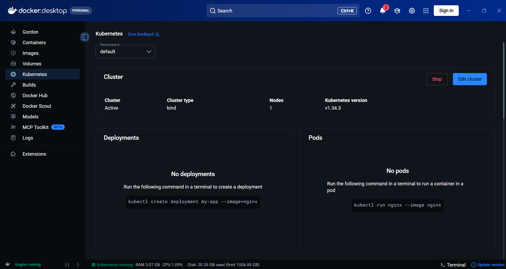

# 🧩 11 — Local Kubernetes Setup

## 🎯 Learning Objectives

By the end of this module, you'll understand:

* The difference between Kubernetes and `kubectl`.
* How to check if `kubectl` is installed.
* How to verify that a Kubernetes cluster is running.
* How Docker Desktop provides a local Kubernetes cluster.
* How to inspect the nodes in your cluster.

Before deploying our first application, we need a running Kubernetes cluster.

---

# 🧠 Kubernetes vs kubectl

When people first start learning Kubernetes, it's common to think that installing `kubectl` means Kubernetes is installed.

That's not correct.

Think of it like this:

```text
Kubernetes Cluster
        ▲
        │
     kubectl
```

* **Kubernetes Cluster** is the platform that runs your applications.
* **kubectl** is the command-line tool (CLI) used to communicate with the cluster.

Whenever you run a `kubectl` command, it sends a request to the Kubernetes API Server.

---

# 🖥️ Docker Desktop Kubernetes

Throughout the Docker modules, we've been using Docker Desktop.

Docker Desktop can also run a local Kubernetes cluster.

Open Docker Desktop and select **Kubernetes** from the left sidebar.

You should see a screen similar to the one below.



If Kubernetes is enabled and its status is **Running**, your local Kubernetes cluster is ready to use.

For this playbook, we'll use Docker Desktop's built-in Kubernetes cluster for all the upcoming examples.

---

# ✅ Check if kubectl Is Installed

Open a terminal and run:

```bash
kubectl version --client
```

Example output:

```text
Client Version: v1.34.1
Kustomize Version: v5.7.1
```

If you see a client version, `kubectl` is installed successfully.

---

# ✅ Check if the Cluster Is Running

Next, verify that Kubernetes is running.

```bash
kubectl cluster-info
```

Example output:

```text
Kubernetes control plane is running at https://127.0.0.1:58768

CoreDNS is running at https://127.0.0.1:58768/api/v1/namespaces/kube-system/services/kube-dns:dns/proxy
```

This confirms that:

* Kubernetes is running.
* The Control Plane is available.
* `kubectl` can communicate with the cluster.

---

# ✅ View the Nodes

Now let's see which nodes belong to our cluster.

```bash
kubectl get nodes
```

Example output:

```text
NAME                    STATUS   ROLES           AGE   VERSION
desktop-control-plane   Ready    control-plane   48d   v1.34.3
```

Let's understand the output.

| Column      | Meaning                                            |
| ----------- | -------------------------------------------------- |
| **NAME**    | The name of the node.                              |
| **STATUS**  | Whether the node is healthy and ready to run Pods. |
| **ROLES**   | The role assigned to the node.                     |
| **AGE**     | How long the node has existed.                     |
| **VERSION** | The Kubernetes version running on the node.        |

---

# 🏗️ Why Is There Only One Node?

In a production environment, a Kubernetes cluster usually contains multiple servers.

For learning, Docker Desktop creates a **single-node cluster**.

```text
                Your Computer
                      │
                      ▼
          Docker Desktop Kubernetes
                      │
        ┌───────────────────────────┐
        │ desktop-control-plane     │
        │                           │
        │ • Control Plane           │
        │ • Worker Node             │
        │ • Runs Your Pods          │
        └───────────────────────────┘
```

Although the node is named **desktop-control-plane**, Docker Desktop also uses it to run your application Pods.

This gives you a complete Kubernetes environment without needing multiple machines.

---

# 🚀 Local vs Production

For learning:

```text
One Computer
      │
      ▼
One Kubernetes Node
```

In production:

```text
Control Plane
       │
       ├───────────────┐
       ▼               ▼
Worker Node A    Worker Node B
       │               │
      Pods            Pods
```

The concepts are exactly the same. The only difference is the number of machines.

---

# 🎯 Key Takeaway

To work with Kubernetes, you need two things:

* A **Kubernetes cluster** that runs your applications.
* **kubectl**, the CLI used to communicate with the cluster.

Docker Desktop provides both Docker and a local Kubernetes cluster, making it a great environment for learning.

In the next module, we'll deploy our first Kubernetes Pod and interact with it using `kubectl`.
